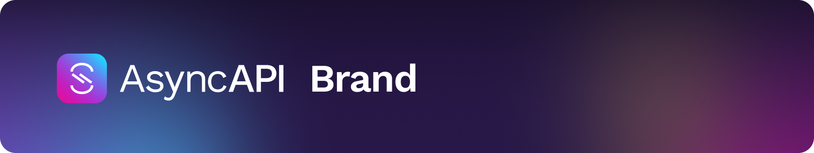
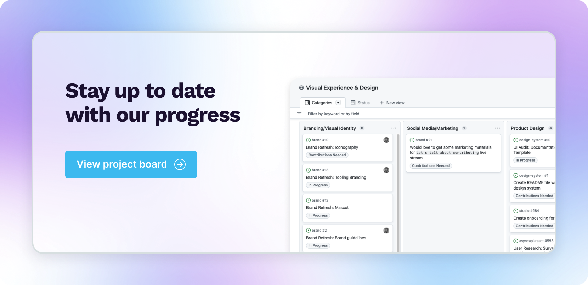

## 🎨 Welcome to the AsyncAPI brand
In this project, we focus on all things related to the creative development of the AsyncAPI brand. The overarching goal for this repo is to provide a space where we can collaborate to define visuals such as logos, colors, typography, iconography, and more! All are welcome to contribute ideas and work where you feel comfortable.

Before you submit your contribution, please read our [Code of Conduct](https://github.com/asyncapi/.github/blob/master/CODE_OF_CONDUCT.md) and [Contribution Guidelines](https://github.com/asyncapi/asyncapi/blob/master/CONTRIBUTING.md#contributing-to-asyncapi).

## ✨ Brand Guidelines
Navigate through our brand guidelines using the links below

- [Brand Guidelines](brand-guidelines/README.md)
    - [Logo](brand-guidelines/logo/README.md)
    - [Color](brand-guidelines/color/README.md)
    - [Typography](brand-guidelines/typography/README.md)
    - [Branded Tools](brand-guidelines/branded-tools/README.md)
    - [Mascot](illustrations/mascots/README.md)

## 📖 README assets
Have an AsyncAPI tool/project that you would like to add the logo to?

1. [Download generic banner](./assets/github-repobanner-generic.png) and include it in your README via an `assets` folder in the root of your repository
2. [Request a custom banner](https://github.com/asyncapi/brand/issues/new?&title=New+repo+banner+request&body=Leave+the+title+and+link+of+your+repo+and+any+other+details+here&assignees=mcturco&labels=:art:+design) by submitting an issue

## 🙌 💡 Ready to contribute?
There are plenty of ways to share your contribution with this project, and you don't have to be a designer to do so! We welcome feedback and work alike in the following areas:

- Logo design/usage
- Brand identity
- Typography
- Brand guidelines
- Iconography
- Mascot ideation/illustration
- Marketing/Social Media design
## Icons Usage
AsyncAPI icons are maintained as part of the [AsyncAPI Design system](https://www.figma.com/design/cFsY4LCfKmDqdlaTIJPpA1/AsyncAPI-Design-System?node-id=354-2046&p=f&t=CINUpbY33cZmalFG-0). All icons should follow the AsyncAPI design system — 24px grid, 1.5px stroke, outline-only style.

The full Icon System documentation style guide and usage guidelines are documented in the [Icon System documentation](https://www.figma.com/design/kXSY2ELWaViixVT5gHZUGK/AsyncAPI-Icon-System?node-id=45-462&t=aE3kEtdRSApYj7XK-0). 

How to copy an icon: 
1. Open the [AsyncAPI Design system](https://www.figma.com/design/cFsY4LCfKmDqdlaTIJPpA1/AsyncAPI-Design-System?node-id=354-2046&p=f&t=CINUpbY33cZmalFG-0) 
2. Find the icon you need

3. Right-click → Copy as → SVG 

4. Paste directly into your code or save as a .svg file

5. Do not import icons from react-icons, Font Awesome, Heroicons, or any other external library. 
See the [Icon System documentation](https://www.figma.com/design/kXSY2ELWaViixVT5gHZUGK/AsyncAPI-Icon-System?node-id=45-462&t=aE3kEtdRSApYj7XK-0) for the full usage and contribution guidelines.

**Issues in this repo are open to all who would like to give feedback and/or provide visual work.**

## 📌 Current projects
Browse through current issues and pull requests by visiting the official project board for `Visual Experience & Design`!

 

## 💬 Join the discussion
Join the [AsyncAPI Slack workspace](https://asyncapi.com/slack-invite) and the `#12_design` channel to follow all conversations relating to this repo as well as other topics of design.
